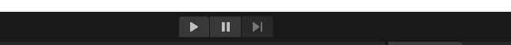

#  Game View

The *game view* represents the final published application where all the game objects from the scene view get displayed. This view is basically what a player is going to see when he actually plays the game.
    

    
In the game view, you cannot edit the entities.

You can also set different resolutions in the dropdown, in the top left corner. This is useful especially when you were working on a mobile title!

The game view is used to test the application in unity.

Use the ‘Play/Pause/ Step’ Toolbar options to test it.
    

Another use for the game view can be just playing something you created and enjoying it. Crazy, right?

