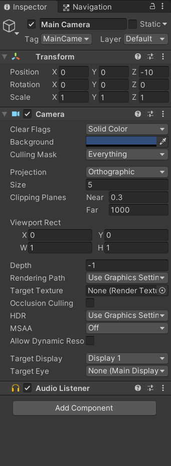

#  Inspector

**Inspector Window** is used to modify the components of the game object that’s used to create a video game.

When you open an empty project, at the very beginning you will see a blank inspector window on the right of the editor. *If you don’t see any inspector window floating on your editor then do the following: 👇*

From the menu, select **Windows > General > Inspector.**
        

        
Click the *Main Camera* from the Hierarchy Window and you will see its properties in the inspector.

*Main Camera* is actually a *game object* in Unity. Hence, you can customize its properties i.e., enabling/disabling the game object, changing its position, color, size, projection, and many more.
    

    
*Recommended: 🔴 Play around with these values to get comfortable with the **Inspector.***
