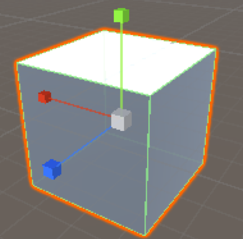
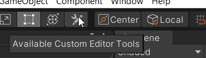
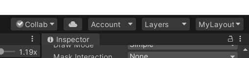

# 4. Toolbar and Navigation in Unity Editor

The Toolbar at the top of the Editor helps in navigating around the scene view and positioning or moving GameObjects.

- Pan – hold the Alt key and click-drag with the middle mouse. Also, hold Alt+Ctrl and click and drag
Zoom: Zoom in and out of scene view, hold the Alt key, and right-click and drag
- Rotate – To rotate in the scene view, hold the Alt key and click and Drag
- Hand tool (Hotkey Q) – Allows you to click and drag around in Scene view
- Move tool (Hotkey W) – Move the object in the scene view. Also, click and drag on the arrow pointing along the desired axis
- Rotate tool (Hotkey E) – Rotate the objects in the Scene view. Click and drag on the axis you wish to rotate along
- Scale tool (Hotkey R) – Increase or decrease the size of objects. Click and drag on the cube at the end of the axis you wish to scale. The white center cube allows you to scale on all axes at once uniformly. 
The same functionality can be achieved by manually entering the respective values under Transform in the Inspector for any object

- Rect Transform tool (Hotkey T) – This tool is a combination of the Move, Rotate and Scale tools

- Transform tool (Hotkey Y) – Works as a combination of all the previous tools (except for Rect Transform)

- Handle Rotation – Switch between Local and Global. When set to local, the tool will be rotated based on the selected Object’s relative rotation. When set to Global the tool will always be aligned to global rotations

- Custom Editor tools – Displays any custom editor tools that have been added to the Project

- Center or Pivot – Changes where the tool gizmo appears on the object, this only changes if the GameObject has a custom pivot point
- Toggle Grid Snapping – Only available when the handle rotation is set to Global, this allows snapping the movement of objects in the Editor
    
    
    
    Top Right corner dropdowns: 
    
- Collab – Launch Unity Collaborate
    
    
    
- Cloud icon opens the Unity Services Window
- *Account* lets you access your Unity account
- *Layers* option lets you control what objects appear in the scene view
- *MyLayout* lets you change the arrangement of Views/Tabs in your Editor

<aside>

> 💡 🚀 **[Join Discord Server](https://discord.gg/J5zDscnzms) → Get your doubts solved by experts instantly**

</aside>

---
